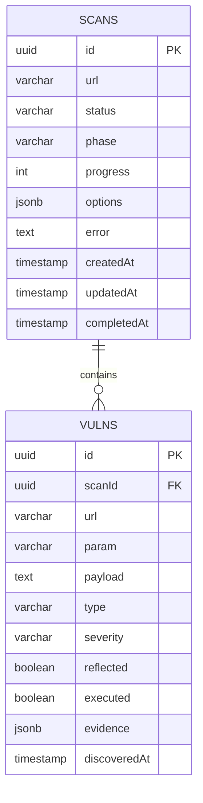

# RedSentinel — Architecture Document

---

## 1. Project Overview

RedSentinel is an AI-powered XSS vulnerability scanner built on a hybrid
microservices architecture. It combines a NestJS TypeScript core for
orchestration and real-time communication with Python FastAPI microservices
for AI inference, context analysis, payload generation, and fuzzing.

**Core Philosophy:**
> NestJS does what it's best at — orchestration, routing, queuing, WebSockets.
> Python does what it's best at — AI inference, security analysis, payload logic.

---

## 2. Technology Stack

| Layer              | Technology               | Reason                                      |
|--------------------|--------------------------|---------------------------------------------|
| Core / API         | NestJS (TypeScript)      | Native modules, DI, guards, interceptors    |
| Real-time          | WebSocket (NestJS Gateway) | Built-in, no extra setup                  |
| Job Queue          | BullMQ + Redis           | Async scan pipeline, retries, concurrency   |
| Crawler            | TypeScript (Playwright)  | Fast, type-safe, same language as core      |
| AI / Security      | Python 3.11 + FastAPI    | ML ecosystem, transformers, Playwright      |
| AI Model           | DistilBERT (HuggingFace) | Context classification                      |
| Payload Ranking    | XGBoost                  | ML-powered payload prioritization           |
| Severity Scoring   | Rule-based (4-axis)      | Deterministic, explainable vulnerability scoring |
| Containerization   | Docker + Docker Compose  | Isolated services, reproducible deploys     |
| Frontend           | Next.js (TypeScript)     | Same language as core, React-based          |
| Database           | PostgreSQL (TypeORM)     | Persistent scan results with migrations     |
| Cache / Queue      | Redis                    | BullMQ job queue backend                    |

---

## 3. Database Schema

The application persists domain data in two tables only: `scans` and `vulns`.
TypeORM also maintains its own migration ledger in `typeorm_migrations`, but
that table is framework metadata rather than a product model.



### Domain Notes

| Table | Purpose |
|-------|---------|
| `scans` | Scan lifecycle state, progress, config, and terminal outcome |
| `vulns` | Findings discovered during a scan, keyed back to a scan |

`ScanStatus`, `ScanPhase`, `VulnType`, and `VulnSeverity` are enum-like application values stored as `varchar` columns.

---

## 4. High-Level Architecture

```diagram

┌──────────────────────────────────────────────────────────────┐
│                   CLIENT (Browser / CLI)                      │
└──────────────────────────┬───────────────────────────────────┘
                           │  REST / WebSocket
                           ▼
┌──────────────────────────────────────────────────────────────┐
│                 CORE — NestJS (TypeScript)  :3000             │
│                                                              │
│   ┌──────────┐   ┌──────────────┐   ┌──────────────────┐    │
│   │ REST API │   │  WebSocket   │   │   Job Queue      │    │
│   │ Gateway  │   │  Gateway     │   │  (BullMQ/Redis)  │    │
│   └────┬─────┘   └──────┬───────┘   └────────┬─────────┘    │
│        └────────────────┼────────────────────┘              │
│                         │                                    │
│                 ┌────────▼────────┐                          │
│                 │  ORCHESTRATOR   │                          │
│                 │  Scan Pipeline  │                          │
│                 └────────┬────────┘                          │
│                          │                                   │
│         ┌────────────────┼────────────────┐                  │
│         │                │                │                  │
│   ┌─────▼──────┐  ┌──────▼──────┐  ┌─────▼──────────┐      │
│   │  Crawler   │  │  Scan Mgr   │  │  Report Mgr    │      │
│   │  Service   │  │  Service    │  │  Service       │      │
│   │  (TS)      │  │  (TS)       │  │  (TS)          │      │
│   └─────┬──────┘  └──────┬──────┘  └─────┬──────────┘      │
│         │                │               │                  │
└─────────┼────────────────┼───────────────┼──────────────────┘
          │                │               │
          │     Internal HTTP/JSON         │
          │                │               │
┌─────────┼────────────────┼───────────────┼──────────────────┐
│         ▼                ▼               ▼                  │
│  ┌─────────────┐  ┌────────────┐  ┌───────────────┐        │
│  │   CONTEXT   │  │ PAYLOAD-GEN│  │    FUZZER     │        │
│  │   MODULE    │  │   MODULE   │  │    MODULE     │        │
│  │  (Python)   │  │  (Python)  │  │   (Python)   │        │
│  │  FastAPI    │  │  FastAPI   │  │   FastAPI    │        │
│  │   :5001     │  │   :5002    │  │    :5003     │        │
│  └─────────────┘  └────────────┘  └───────────────┘        │
│                                                              │
│              PYTHON MICROSERVICES (AI + Security)            │
└──────────────────────────────────────────────────────────────┘
          │                │               │
          └────────────────┼───────────────┘
                           │
                    ┌──────▼──────┐
                    │  PostgreSQL │
                    │  + Redis    │
                    └─────────────┘

```

---

## 5. Scan Pipeline — 5 Phases

Every scan flows through exactly 5 sequential phases, all orchestrated by NestJS Core.

```text

Phase 1: CRAWL          (NestJS — Crawler Service)
         │
         │  Discovers all URLs, params, forms, DOM sinks
         │  Fingerprints WAF (Cloudflare, Akamai, etc.)
         ▼
Phase 2: CONTEXT        (Python — Context Module :5001)
         │
         │  Injects probes, checks reflection points
         │  Classifies context via DistilBERT
         │  Output: { param → { reflects_in, allowed_chars } }
         ▼
Phase 3: PAYLOAD-GEN    (Python — Payload-Gen Module :5002)
         │
         │  Selects from 59K+ payload bank by context
         │  Mutates + obfuscates for WAF bypass
         │  Ranks by success probability
         │  Output: [ { payload, confidence, target_param } ]
         ▼
Phase 4: FUZZ           (Python — Fuzzer Module :5003)
         │
         │  Sends HTTP requests with payloads
         │  Checks HTTP + DOM reflection
         │  Verifies JS execution via Playwright (headless)
         │  Output: [ { payload, reflected, executed, vuln } ]
         ▼
Phase 5: REPORT         (NestJS — Report Service)
         │
         │  Scores each finding via 4-axis severity matrix
         │  Deduplicates by page::source::sink key
         │  Aggregates confirmed vulnerabilities
         │  Generates HTML / PDF / JSON report
         │  Pushes real-time updates via WebSocket
         ▼
        DONE

```

---

## 6. Service Responsibilities

### 6.1 NestJS Core — The Brain

**Role:** Orchestration, routing, state, real-time communication
**Port:** 3000

| Module           | Responsibility                                          |
|------------------|---------------------------------------------------------|
| `ScanModule`     | Scan lifecycle — create, track, cancel, retrieve        |
| `CrawlerModule`  | Spider target, discover params, detect WAF              |
| `ModulesBridge`  | HTTP clients to all 3 Python microservices              |
| `QueueModule`    | BullMQ producers/processors for async scan jobs         |
| `ReportModule`   | Compile results, score severity, generate reports       |
| `AuthModule`     | API key guard for protected endpoints                   |
| `WsGateway`      | WebSocket — push real-time scan progress to client      |

**Severity Scoring Engine** (`common/utils/severity-scorer.ts`):

A rule-based 4-axis scoring matrix applied to every confirmed finding:

| Axis | Values | Score |
|------|--------|-------|
| Execution | executed → 3, reflected → 2, dom-only → 1 | 1-3 |
| Shareability | url_param → 3, postMessage/e.data → 2, URLSearchParams/hash/document.cookie → 1 | 1-3 |
| Sink danger | eval/document.write/location.assign/script → 3, innerHTML/html_body/comment/jQuery_html → 2, attribute → 1 | 1-3 |
| Payload | document.cookie → 3, localStorage → 2, alert triggered → 1, WAF bypass (%) → 1 | 0-4+ |

Total → Severity: 8+ CRITICAL, 6-7 HIGH, 4-5 MEDIUM, 0-3 LOW

5 Override Rules:
1. **HASH_SOURCE_LOW_CAP:** source=location.hash → max LOW
2. **EVAL_SINK_MINIMUM_HIGH:** sink=eval → min HIGH
3. **CONFIRMED_SENSITIVE_EXEC:** executed + document.cookie → CRITICAL
4. **WAF_BYPASS_MEDIUM_MINIMUM:** reflected + encoded + exactMatch → min MEDIUM
5. **POSTMESSAGE_MEDIUM_MINIMUM:** source=e.data/postMessage → min MEDIUM

**Deduplication:** Composite key format `page::source::sink` prevents duplicate findings for the same injection point.

### 6.2 Context Module — Python :5001

**Role:** Determine where and how input is reflected
**Model:** DistilBERT (fine-tuned XSS context classifier)

| File                     | Purpose                                           |
|--------------------------|---------------------------------------------------|
| `probe_injector.py`      | Inject unique markers into params                 |
| `reflection_analyzer.py` | Parse response for marker reflection              |
| `char_fuzzer.py`         | Test which special chars survive sanitization     |
| `html_parser.py`         | Identify exact DOM position of reflection         |
| `ai_classifier.py`       | DistilBERT inference — classify context type      |

**Context Types Classified:**

- `html_body` — reflected raw in HTML
- `attribute` — reflected inside an HTML attribute
- `js_string` — reflected inside a JavaScript string
- `js_block` — reflected inside a script block
- `url` — reflected in a `href` or `src`
- `none` — not reflected / filtered

### 6.3 Payload-Gen Module — Python :5002

**Role:** Select and mutate payloads based on context + WAF
**Payload Bank:** 59,000+ curated + synthetic XSS payloads

| File             | Purpose                                               |
|------------------|-------------------------------------------------------|
| `bank.py`        | Load + query the 59K+ payload database                |
| `selector.py`    | Filter payloads by context type                       |
| `mutator.py`     | AI-driven payload mutation for novelty                |
| `obfuscator.py`  | Encode payloads for WAF bypass (unicode, hex, etc.)   |
| `ranker.py`      | Heuristic fallback: 5-component weighted scoring      |
| `xgboost_ranker.py` | ML-powered payload ranking using XGBoost           |
| `feature_extractor.py` | Converts payload+context into ~30 features for XGBoost |

### 6.4 Fuzzer Module — Python :5003

**Role:** Execute payloads and confirm vulnerabilities
**Browser Engine:** Playwright (Chromium headless)

| File                   | Purpose                                           |
|------------------------|---------------------------------------------------|
| `http_sender.py`       | Send HTTP requests with injected payloads         |
| `reflection_checker.py`| Verify payload appears in response body           |
| `browser_verifier.py`  | Headless browser — confirm JS execution           |
| `dom_xss_scanner.py`   | Scan for DOM-based XSS sinks                      |

---

## 7. API Contracts (Inter-Service)

### 7.1 Core → Context Module

```bash

POST <http://context:5001/analyze>

Request:
{
  "url": "<https://target.com/search?q=test>",
  "params": ["q", "search", "id"],
  "waf": "cloudflare"
}

Response:
{
  "q": {
    "reflects_in": "attribute",
    "allowed_chars": ["<", ">", "\""],
    "context_confidence": 0.97
  },
  "search": {
    "reflects_in": "html_body",
    "allowed_chars": ["<", ">", "\"", "'"],
    "context_confidence": 0.94
  }
}

```

### 7.2 Core → Payload-Gen Module

```bash

POST <http://payload-gen:5002/generate>

Request:
{
  "contexts": {
    "q": { "reflects_in": "attribute", "allowed_chars": [...] },
    "search": { "reflects_in": "html_body", "allowed_chars": [...] }
  },
  "waf": "cloudflare",
  "max_payloads": 50
}

Response:
{
  "payloads": [
    {
      "payload": "\" onmouseover=alert(1) x=\"",
      "target_param": "q",
      "context": "attribute",
      "confidence": 0.92,
      "waf_bypass": true
    },
    {
      "payload": "",
      "target_param": "search",
      "context": "html_body",
      "confidence": 0.88,
      "waf_bypass": false
    }
  ]
}

```

### 7.3 Core → Fuzzer Module

```bash

POST <http://fuzzer:5003/test>

Request:
{
  "url": "<https://target.com/search>",
  "payloads": [
    {
      "payload": "",
      "target_param": "search",
      "confidence": 0.88
    }
  ],
  "verify_execution": true,
  "timeout": 10000
}

Response:
{
  "results": [
    {
      "payload": "",
      "target_param": "search",
      "reflected": true,
      "executed": true,
      "vuln": true,
      "type": "reflected_xss",
      "evidence": {
        "response_code": 200,
        "reflection_position": "html_body",
        "browser_alert_triggered": true
      }
    }
  ]
}

```

### 7.4 WebSocket Events (Core → Client)

```c

Event: scan:progress
{
  "scanId": "abc-123",
  "phase": "FUZZ",
  "progress": 67,
  "message": "Testing payload 34/50 on param: search"
}

Event: scan:finding
{
  "scanId": "abc-123",
  "vuln": {
    "param": "search",
    "payload": "",
    "type": "reflected_xss",
    "severity": "HIGH"
  }
}

Event: scan:complete
{
  "scanId": "abc-123",
  "summary": {
    "total_params": 12,
    "params_tested": 12,
    "vulns_found": 3,
    "duration_ms": 42300
  },
  "reportUrl": "/reports/abc-123.html"
}

```

---

## 8. REST API Reference (NestJS Core)

| Method | Endpoint              | Description                         |
|--------|-----------------------|-------------------------------------|
| POST   | `/scan`               | Start a new scan                    |
| GET    | `/scan/:id`           | Get scan status + results           |
| DELETE | `/scan/:id`           | Cancel an active scan               |
| GET    | `/scan/:id/report`    | Download report (HTML/PDF/JSON)     |
| GET    | `/scans`              | List all scans (paginated)          |
| GET    | `/health`             | Health check (all services)         |

### POST /scan — Request Body

```json
{
  "url": "https://target.com",
  "options": {
    "depth": 3,
    "max_params": 100,
    "verify_execution": true,
    "waf_bypass": true,
    "max_payloads_per_param": 50,
    "timeout": 60000,
    "report_format": ["html", "json"]
  }
}
```

---

## 9. Folder Structure

```bash
red-sentinel/
│
├── core/                              # NestJS (TypeScript) — Port 3000
│   ├── src/
│   │   ├── app.module.ts
│   │   ├── main.ts
│   │   │
│   │   ├── scan/
│   │   │   ├── scan.module.ts
│   │   │   ├── scan.controller.ts     # REST endpoints
│   │   │   ├── scan.service.ts        # Pipeline orchestrator + vuln persistence
│   │   │   ├── scan.gateway.ts        # WebSocket gateway
│   │   │   ├── entities/
│   │   │   │   ├── scan.entity.ts      # TypeORM entity — scans table
│   │   │   │   └── vuln.entity.ts      # TypeORM entity — vulns table
│   │   │   ├── migrations/            # TypeORM schema migrations
│   │   │   └── dto/
│   │   │       ├── create-scan.dto.ts
│   │   │       └── scan-result.dto.ts
│   │   │
│   │   ├── crawler/
│   │   │   ├── crawler.module.ts
│   │   │   ├── crawler.service.ts     # Spider + param discovery
│   │   │   ├── waf-detector.service.ts
│   │   │   └── dom-analyzer.service.ts
│   │   │
│   │   ├── modules-bridge/
│   │   │   ├── bridge.module.ts
│   │   │   ├── context-client.service.ts   # → :5001
│   │   │   ├── payload-client.service.ts   # → :5002
│   │   │   └── fuzzer-client.service.ts    # → :5003
│   │   │
│   │   ├── queue/
│   │   │   ├── queue.module.ts
│   │   │   ├── scan.producer.ts
│   │   │   └── scan.processor.ts
│   │   │
│   │   ├── report/
│   │   │   ├── report.module.ts
│   │   │   ├── report.service.ts
│   │   │   └── templates/
│   │   │       ├── report.html.hbs
│   │   │       └── report.pdf.hbs
│   │   │
│   │   ├── auth/
│   │   │   ├── auth.module.ts
│   │   │   └── api-key.guard.ts
│   │   │
│   │   └── common/
│   │       ├── interfaces/
│   │       │   ├── scan.interface.ts
│   │       │   ├── vuln.interface.ts
│   │       │   └── crawler.interface.ts
│   │       ├── exceptions/
│   │       │   └── scan.exceptions.ts
│   │       └── utils/
│   │           ├── url.utils.ts
│   │           ├── severity-scorer.ts      # 4-axis scoring matrix + overrides
│   │           └── severity-scorer.spec.ts # 62 unit tests
│   │
│   ├── test/
│   ├── nest-cli.json
│   ├── tsconfig.json
│   ├── package.json
│   ├── Dockerfile
│   └── .env
│
├── modules/
│   │
│   ├── context-module/                # Python FastAPI — Port 5001
│   │   ├── app.py
│   │   ├── probe_injector.py
│   │   ├── reflection_analyzer.py
│   │   ├── char_fuzzer.py
│   │   ├── html_parser.py
│   │   ├── ai_classifier.py
│   │   ├── model/
│   │   │   ├── checkpoints/
│   │   │   └── tokenizer/
│   │   ├── requirements.txt
│   │   └── Dockerfile
│   │
│   ├── payload-gen-module/            # Python FastAPI — Port 5002
│   │   ├── app.py
│   │   ├── bank.py
│   │   ├── selector.py
│   │   ├── mutator.py
│   │   ├── obfuscator.py
│   │   ├── ranker.py                  # Heuristic fallback scorer
│   │   ├── xgboost_ranker.py          # ML-powered XGBoost ranker
│   │   ├── feature_extractor.py       # ~30 features for XGBoost model
│   │   ├── requirements.txt
│   │   └── Dockerfile
│   │
│   ├── fuzzer-module/                 # Python FastAPI — Port 5003
│   │   ├── app.py
│   │   ├── http_sender.py
│   │   ├── reflection_checker.py
│   │   ├── browser_verifier.py
│   │   ├── dom_xss_scanner.py
│   │   ├── requirements.txt
│   │   └── Dockerfile
│   │
│   └── shared/                        # Shared Python utilities
│       ├── schemas.py                 # Pydantic models (shared DTOs)
│       └── constants.py
│
├── ai/                                # AI training pipeline
│   ├── dataset/
│   │   ├── payloads_24k.json
│   │   └── labeled_contexts.csv
│   ├── model/
│   │   ├── distilbert-base/
│   │   └── tokenizer/
│   └── training/
│       ├── train.py
│       ├── evaluate.py
│       └── config.yaml
│
├── dashboard/                         # Next.js frontend — Port 8080
│   ├── app/
│   ├── components/
│   ├── package.json
│   └── Dockerfile
│
├── docker-compose.yml
├── docker-compose.dev.yml
├── .env.example
├── README.md
└── cli.ts                             # Standalone CLI tool
```

---

## 10. Docker Compose

```yaml
version: '3.8'

services:

  core:
    build: ./core
    container_name: redsentinel-core
    ports:
      - "3000:3000"
    depends_on:
      - redis
      - postgres
      - context
      - payload-gen
      - fuzzer
    environment:
      - NODE_ENV=production
      - CONTEXT_URL=http://context:5001
      - PAYLOAD_GEN_URL=http://payload-gen:5002
      - FUZZER_URL=http://fuzzer:5003
      - REDIS_URL=redis://redis:6379
      - DATABASE_URL=postgresql://rs:rs@postgres:5432/redsentinel
    restart: unless-stopped

  context:
    build: ./modules/context-module
    container_name: redsentinel-context
    ports:
      - "5001:5001"
    volumes:
      - ./ai/model:/app/model
    restart: unless-stopped

  payload-gen:
    build: ./modules/payload-gen-module
    container_name: redsentinel-payload-gen
    ports:
      - "5002:5002"
    volumes:
      - ./ai/dataset:/app/data
    restart: unless-stopped

  fuzzer:
    build: ./modules/fuzzer-module
    container_name: redsentinel-fuzzer
    ports:
      - "5003:5003"
    restart: unless-stopped

  dashboard:
    build: ./dashboard
    container_name: redsentinel-dashboard
    ports:
      - "8080:8080"
    depends_on:
      - core
    environment:
      - NEXT_PUBLIC_API_URL=http://localhost:3000
      - NEXT_PUBLIC_WS_URL=ws://localhost:3000
    restart: unless-stopped

  redis:
    image: redis:7-alpine
    container_name: redsentinel-redis
    ports:
      - "6379:6379"
    restart: unless-stopped

  postgres:
    image: postgres:16-alpine
    container_name: redsentinel-postgres
    ports:
      - "5432:5432"
    environment:
      - POSTGRES_USER=rs
      - POSTGRES_PASSWORD=rs
      - POSTGRES_DB=redsentinel
    volumes:
      - pgdata:/var/lib/postgresql/data
    restart: unless-stopped

volumes:
  pgdata:
```

---

## 11. Development Roadmap

| Phase | Days   | Stack           | Deliverable                                    | Status   |
|-------|--------|-----------------|------------------------------------------------|----------|
| 1     | 1–2    | Python          | 59K+ XSS payload dataset built + labeled (59,122 samples) | ✅ DONE  |
| 2     | 3      | Python          | DistilBERT model setup + tokenizer configured  | ✅ DONE  |
| 3     | 4–5    | Python          | AI context classifier trained + evaluated      | ✅ DONE  |
| 4     | 6–7    | NestJS          | Core scaffold: scan pipeline, queue, WebSocket | ✅ DONE  |
| 5     | 8–9    | TypeScript      | Crawler: spider, param discovery, WAF detect   | ✅ DONE  |
| 6     | 10–11  | Python          | Context Module: probe, reflect, AI classify    | ✅ DONE  |
| 7     | 12–13  | Python          | Payload-Gen Module: select, mutate, obfuscate  | ✅ DONE  |
| 8     | 14–15  | Python          | Fuzzer Module: send, reflect-check, browser    | ✅ DONE  |
| 9     | 16     | TypeScript      | Report engine: HTML / PDF / JSON output        | ✅ DONE  |
| 10    | 17–18  | Docker Compose  | Full integration + end-to-end test             | ✅ DONE  |
| 11    | 19–20  | Next.js         | Dashboard: scan UI, results, reports           | ✅ DONE  |
| 12    | 21     | All             | Tests, docs, CLI polish, release               | ✅ DONE  |

---

## 12. Key Design Decisions

| Decision                     | Choice                  | Rationale                                          |
|------------------------------|-------------------------|----------------------------------------------------|
| Core language                | TypeScript / NestJS     | Type safety, native DI, WebSocket, BullMQ          |
| AI / security language       | Python                  | HuggingFace, transformers, Playwright ecosystem    |
| Inter-service protocol       | HTTP/JSON               | Simple, debuggable, REST-compatible                |
| Queue system                 | BullMQ + Redis          | Reliable async jobs, retry logic, concurrency      |
| Browser automation           | Playwright              | Best-in-class headless XSS verification            |
| AI model                     | DistilBERT              | Fast inference, small size, high accuracy          |
| Report formats               | HTML + PDF + JSON       | Human-readable + machine-parseable                 |
| Frontend                     | Next.js                 | Same TS ecosystem as core, React-based             |

---

## 13. Environment Variables

```bash
# Core (NestJS)
NODE_ENV=production
PORT=3000

# Python service URLs
CONTEXT_URL=http://context:5001
PAYLOAD_GEN_URL=http://payload-gen:5002
FUZZER_URL=http://fuzzer:5003

# Infrastructure
REDIS_URL=redis://redis:6379
DATABASE_URL=postgresql://rs:rs@postgres:5432/redsentinel

# Auth
API_KEY_SECRET=your-secret-here

# Scan defaults
DEFAULT_SCAN_DEPTH=3
DEFAULT_MAX_PAYLOADS=50
DEFAULT_TIMEOUT_MS=60000
```

---

*RedSentinel v2.0 — NestJS Core + Python AI Microservices*
*Architecture locked. Ready to build.*
