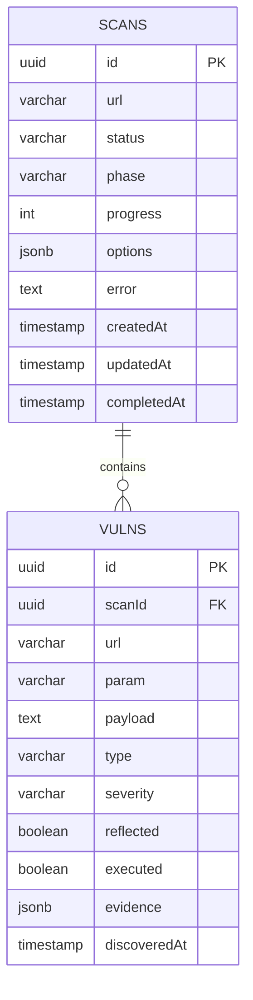

# RedSentinel — Architecture Document

This document describes the implementation currently present in the repository. Application code, DTOs, schemas, Docker Compose, and tests are the source of truth.

---

## 1. Overview

RedSentinel is an XSS scanner built from:

- **NestJS Core** on port `3000` for REST APIs, WebSockets, scan orchestration, queue workers, crawling, persistence, reports, health checks, and authentication.
- **Next.js Dashboard** on port `8080` for the browser UI.
- **Python FastAPI microservices** for context analysis, payload generation, and fuzzing.
- **Redis/BullMQ** for asynchronous scan jobs.
- **PostgreSQL/TypeORM** for scan and vulnerability persistence.

---

## 2. Runtime Services

| Service | Port | Implementation | Main responsibilities |
|---|---:|---|---|
| Core | 3000 | NestJS / TypeScript | Scan API, queue, crawler, report generation, health, WebSocket progress, auth, persistence |
| Dashboard | 8080 | Next.js | Browser UI |
| Context module | 5001 | FastAPI / Python | Reflection probing, context classification, allowed character fuzzing |
| Payload-gen module | 5002 | FastAPI / Python | Payload bank loading, context-aware selection, mutation, obfuscation, ranking |
| Fuzzer module | 5003 | FastAPI / Python | Payload sending, reflection checks, browser verification, DOM-XSS scanning, training data collection |
| Redis | 6379 | Redis | BullMQ backend |
| PostgreSQL | 5432 | PostgreSQL | Persistent `scans`, `vulns`, and migration metadata |

Docker Compose mounts:

| Mount/volume | Purpose |
|---|---|
| `./model:/app/model:ro` | Context classifier artifacts and metadata |
| `./dataset/splits:/app/dataset/splits:ro` | Payload bank splits for payload-gen |
| `./model/ranker:/app/model/ranker:ro` | XGBoost ranker artifacts |
| `training_data:/app/training_data` | Fuzzer-collected training samples |
| `reports:/app/reports` | Generated report files |
| `pgdata:/var/lib/postgresql/data` | PostgreSQL data |

---

## 3. High-Level Architecture

```text
Browser / CLI
    │ REST / Socket.IO
    ▼
Dashboard (Next.js :8080) ───────► Core (NestJS :3000)
                                      │
                                      ├─ ScanController / ReportController / HealthController
                                      ├─ ScanGateway for live progress
                                      ├─ BullMQ queue via Redis
                                      ├─ TypeORM persistence in PostgreSQL
                                      ├─ Crawler service
                                      ├─ Report service
                                      └─ ModulesBridge HTTP clients
                                             │
                                             ├─ Context module :5001 /analyze
                                             ├─ Payload-gen module :5002 /generate, /ranker/info
                                             └─ Fuzzer module :5003 /fuzz
```

---

## 4. Database Model

The product domain persists scan state and findings in `scans` and `vulns`. TypeORM also maintains migration metadata in `typeorm_migrations`.



---

## 5. Scan Pipeline

The queue processor orchestrates the scan in these phases:

1. **AUTH** — optional target-site login when `scan.options.auth.enabled` is true.
2. **CRAWL** — discover URLs, query parameters, forms, DOM signals, and WAF information. `singlePage` skips crawling and scans only the canonical submitted URL.
3. **CONTEXT** — call the context module for each target URL/parameter set.
4. **PAYLOAD-GEN** — call payload-gen with context data and `max_payloads` derived from `maxPayloadsPerParam`.
5. **FUZZ** — call the fuzzer `/fuzz` endpoint for reflected, stored, form, fragment, and DOM-oriented checks as supported by the queue logic and fuzzer implementation.
6. **REPORT** — score findings, persist vulnerabilities, and generate requested report formats.

---

## 6. Core Modules

| Module/folder | Implemented role |
|---|---|
| `scan/` | Scan lifecycle controller, service, DTOs, gateway, entities, and audit access |
| `crawler/` | URL/form/parameter discovery, DOM analysis, WAF detection |
| `queue/` | BullMQ producer and scan processor |
| `modules-bridge/` | HTTP clients for context, payload-gen, and fuzzer services |
| `report/` | Report controller, service, templates, and generated file handling |
| `health/` | Aggregate health checks for Python services |
| `userauth/` | Dashboard/user JWT/cookie auth used by guarded scan/report routes |
| `auth/` | API-key auth components for machine-client style auth where wired |
| `scanner-log/` | Scanner/audit log support |
| `common/` | Interfaces, exceptions, URL helpers, severity scorer |

`ScanController` and `ReportController` are guarded by `JwtAuthGuard`. `/health` is public.

---

## 7. Core REST API Reference

### Scan routes

| Method | Endpoint | Response/behavior |
|---|---|---|
| `POST` | `/scan` | Creates a scan, enqueues it, returns the scan record. |
| `GET` | `/scan/:id` | Returns scan data plus `vulns`. |
| `GET` | `/scans?page=&limit=` | Returns a paginated array of scan records plus `vulns`. |
| `GET` | `/scan/:id/audit` | Returns `{ scanId, logs }`. |
| `GET` | `/scan/:id/report` | Returns `{ reportUrl: "/reports/<id>.html" }` only. It does not directly download HTML/PDF/JSON. |
| `DELETE` | `/scan/:id` | Cancels an active scan. |
| `DELETE` | `/scans/:id` | Permanently deletes a scan and its results. |
| `DELETE` | `/scans` | Deletes all scans/results/reports and returns `{ deleted }`. |

### Report routes

| Method | Endpoint | Response/behavior |
|---|---|---|
| `GET` | `/reports/:scanId` | Returns available formats, broken formats, and download links. |
| `GET` | `/reports/:scanId/download?format=html\|json\|pdf` | Sends an existing report file if present. |
| `GET` | `/reports/:scanId/regenerate?formats=html,json,pdf` | Regenerates selected formats and returns `{ scanId, reportUrl, formats }`. |

### Health route

| Method | Endpoint | Response/behavior |
|---|---|---|
| `GET` | `/health` | Returns `{ status, uptime, timestamp, services }` where `services` contains context, payload-gen, and fuzzer status. |

### `POST /scan` request body

Implemented DTO fields use camelCase:

```json
{
  "url": "https://target.example",
  "options": {
    "depth": 3,
    "maxParams": 100,
    "verifyExecution": true,
    "wafBypass": true,
    "maxPayloadsPerParam": 50,
    "timeout": 60000,
    "reportFormat": ["html", "json"],
    "singlePage": false,
    "auth": {
      "enabled": true,
      "loginUrl": "https://target.example/login",
      "username": "alice",
      "password": "secret",
      "usernameSelector": "input[name=\"username\"]",
      "passwordSelector": "input[name=\"password\"]",
      "submitSelector": "button[type=\"submit\"]",
      "postLoginWaitMs": 3000,
      "successUrlContains": "/dashboard"
    }
  }
}
```

`options.auth` is target application authentication for the scanner. It is separate from RedSentinel API authentication.

---

## 8. Python Microservice Contracts

The shared schema file is used by payload-gen and fuzzer, but the context module also defines local request/response models. Keep this duplication in mind when changing contracts.

### 8.1 Context module — `POST /analyze`

Implemented local request model:

```json
{
  "url": "https://target.example/search?q=test",
  "params": ["q"],
  "waf": "none"
}
```

Implemented response is a bare parameter map:

```json
{
  "q": {
    "reflects_in": "html_body",
    "allowed_chars": ["<", ">", "\""],
    "context_confidence": 0.94
  }
}
```

`GET /health` returns:

```json
{
  "status": "ok",
  "service": "context-module",
  "ai_model_loaded": true
}
```

### 8.2 Payload-gen module — `POST /generate`

Implemented shared request model:

```json
{
  "contexts": {
    "q": {
      "reflects_in": "html_body",
      "allowed_chars": ["<", ">"],
      "context_confidence": 0.94
    }
  },
  "waf": "none",
  "max_payloads": 50
}
```

Implemented response model:

```json
{
  "payloads": [
    {
      "payload": "",
      "target_param": "q",
      "context": "html_body",
      "confidence": 0.91,
      "waf_bypass": false,
      "technique": "original",
      "severity": "medium"
    }
  ]
}
```

`GET /health` returns payload-bank and ranker state. `GET /ranker/info` returns ranker status and feature importance.

Payload ranking uses XGBoost only when the ranker model is available; otherwise it falls back to heuristic scoring.

### 8.3 Fuzzer module — `POST /fuzz`

`POST /test` is kept as a legacy compatibility alias and is hidden from the generated FastAPI schema. The Core bridge prefers `/fuzz` and falls back to `/test` only when `/fuzz` is unavailable, which allows mixed deployments during the rename.

Implemented shared request model:

```json
{
  "url": "https://target.example/search",
  "payloads": [
    {
      "payload": "",
      "target_param": "q",
      "confidence": 0.91,
      "technique": "original",
      "severity": "medium",
      "context": "html_body"
    }
  ],
  "verify_execution": true,
  "timeout": 10000,
  "stored_mode": false,
  "display_url": "",
  "form_method": "GET",
  "form_fields": {},
  "context": "html_body",
  "waf": "none",
  "allowed_chars": ["<", ">"],
  "auth_cookie_header": "session=abc123",
  "auth_storage_state": {
    "cookies": [],
    "origins": []
  }
}
```

Implemented response model:

```json
{
  "results": [
    {
      "payload": "",
      "target_param": "q",
      "reflected": true,
      "executed": true,
      "vuln": true,
      "type": "reflected_xss",
      "evidence": {
        "response_code": 200,
        "reflection_position": "html_body",
        "browser_alert_triggered": true
      }
    }
  ]
}
```

`GET /health` returns training sample counts and success rate. `GET /training/stats` returns detailed fuzzer training-data collection statistics.

---

## 9. Context and Finding Taxonomies

Do not describe the project as having one universal six-class taxonomy.

Runtime reflection contexts include values produced by the context module and DOM/parser heuristics, such as:

- `html_body`
- `attribute`
- `js_string`
- `js_block`
- `url`
- `none`

Fuzzer/vulnerability finding types are separate labels and may include:

- `reflected_xss`
- `stored_xss`
- `dom_xss`
- `dom_stored_xss`
- `template_injection`
- `svg_xss`
- `mutation_xss`

Training/evaluation labels may use narrower label sets depending on the specific dataset or script.

---

## 10. Severity Scoring

Runtime severity is implemented as a deterministic rule-based scorer in `core/src/common/utils/severity-scorer.ts`. This value remains the scanner's primary severity label.

Reports also include a separate analytical risk model from `core/src/common/utils/risk-calculus.ts`. That report-layer model derives a CVSS v3.1-inspired vector, base score, exploit probability, Single Loss Expectancy (SLE), Annualized Rate of Occurrence (ARO), and Annualized Loss Expectancy (ALE). These values are interpretive evaluation fields and do not replace the runtime severity algorithm.

Scoring axes:

| Axis | Examples | Score range |
|---|---|---:|
| Execution | executed, reflected, DOM-only | 1-3 |
| Shareability | URL param, postMessage/e.data, URLSearchParams/hash/document.cookie | 1-3 |
| Sink danger | eval/script/document.write/location.assign, innerHTML/html_body/comment/jQuery_html, attribute/href | 1-3 |
| Payload impact | `document.cookie`, `localStorage`, alert triggered, `%` encoding | 0+ |

Thresholds:

| Total score | Severity |
|---:|---|
| 8+ | CRITICAL |
| 6-7 | HIGH |
| 4-5 | MEDIUM |
| 0-3 | LOW |

Override rules:

1. `HASH_SOURCE_MEDIUM_CAP`: `location.hash`/`hash` source is capped at MEDIUM.
2. `EVAL_SINK_MINIMUM_HIGH`: `eval` sink is at least HIGH.
3. `CONFIRMED_SENSITIVE_EXEC`: executed payload containing `document.cookie` is CRITICAL.
4. `WAF_BYPASS_MEDIUM_MINIMUM`: reflected exact-match payload containing `%` is at least MEDIUM.
5. `POSTMESSAGE_MEDIUM_MINIMUM`: `postMessage`/`e.data` source is at least MEDIUM.

Report-layer analytical risk fields:

| Field | Meaning |
|---|---|
| `cvssVectorString` | CVSS v3.1-style metric vector inferred from scanner evidence |
| `cvssBaseScore` | CVSS-inspired base score for critical evaluation |
| `exploitProbability` | Estimated exploitation probability from reachability, execution evidence, complexity, interaction, and base score |
| `singleLossExpectancy` | Estimated one-event loss using the configured/default asset value |
| `annualizedRateOfOccurrence` | Estimated yearly occurrence rate |
| `annualizedLossExpectancy` | `ARO × SLE`; comparative estimate, not a financial guarantee |

---

## 11. Reports

The report module supports available-format discovery, direct file download, and regeneration through `/reports/:scanId` routes.

`/scan/:id/report` is a convenience pointer that returns `{ reportUrl: "/reports/<id>.html" }`; it is not the file-download endpoint.

Generated formats depend on `reportFormat` in scan options or explicit `formats` passed to regenerate. A download succeeds only if the file exists.

---

## 12. Dataset and ML Claims

Use “approximately 59K+” for the payload bank unless an exact count is proven by a currently tracked artifact or script output.

Dataset sources documented in `dataset/README.md` are:

- AwesomeXSS
- PayloadsAllTheThings
- XSSGAI
- PortSwigger XSS cheat sheet content

The context classifier may use model artifacts under `model/`; missing large checkpoint binaries should be treated as a supported local/deployment artifact condition rather than a repository error. Payload ranking uses XGBoost when `model/ranker/` loads successfully and heuristic ranking otherwise.

---

## 13. Folder Structure

```text
red-sentinel/
├── core/                    NestJS API, queue, crawler, reports, auth, health, migrations
├── dashboard/               Next.js dashboard
├── modules/
│   ├── context-module/      FastAPI context/reflection analysis service
│   ├── payload-gen-module/  FastAPI payload generation/ranking service
│   ├── fuzzer-module/       FastAPI payload execution/verification service
│   └── shared/              Shared Python Pydantic schemas used by services
├── dataset/                 Curated/processed/split payload data and ignored raw sources
├── model/                   Tokenizer, ranker artifacts, small metadata, local checkpoints
├── ai/                      Training scripts
├── tools/                   Offline inference/maintenance utilities
├── scripts/                 Project automation and smoke tests
├── tests/                   Python integration/regression tests
├── docs/                    Canonical docs plus archived historical notes
├── docker-compose.yml       Runtime service composition
└── RUN.md                   Manual run guide
```

---

## 14. Test Claims

The repository includes test suites and npm/pytest commands, but this document does not claim current pass counts. Record actual command results in release notes or audit logs when tests are run.
